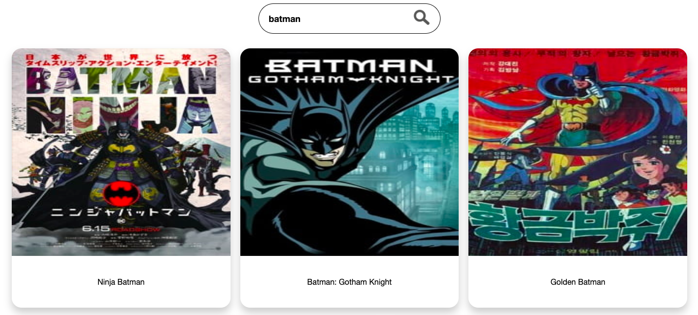

# About
> Basic Anime List React App build in react.js

# Created React App using Below boilerplate 
- https://github.com/react-boilerplate/react-boilerplate

# Deployed on github using below article
- https://dev.to/yuribenjamin/how-to-deploy-react-app-in-github-pages-2a1f

## Feature's
- Search Bar with debouncing so api will get call after user stop searching for 500ms
- Lazy loading on scroll end.

## Prerequisite
- Node 
- react 

## Step to run the project
- clone the repo
- $ npm install
- $ npm start

## demo image

